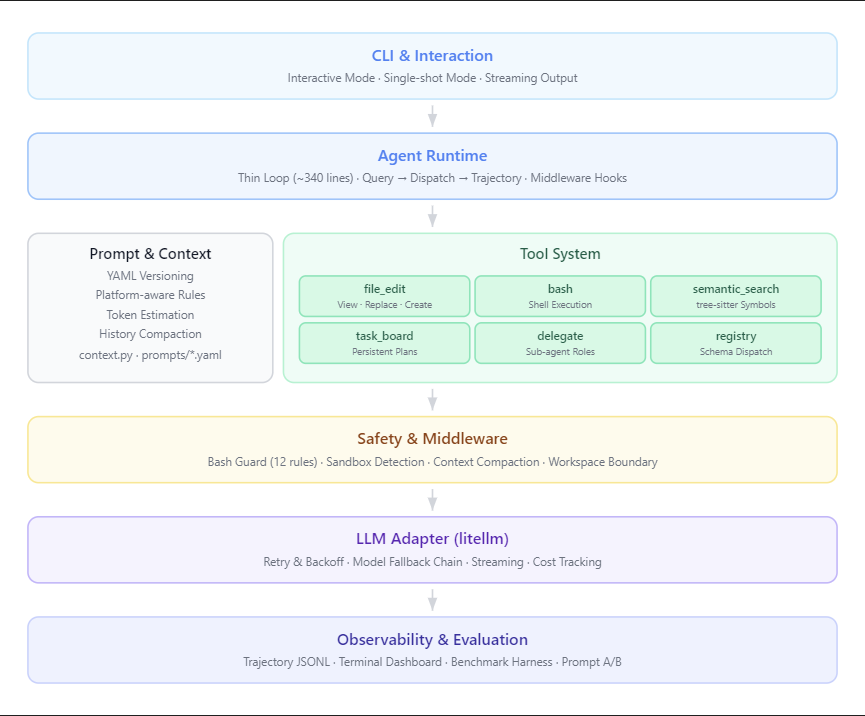

<div align="center">
  <h1>🤖 CodingAgent</h1>
  <p><strong>基于 Harness 思想从零构建的 Python Coding Agent，核心循环仅 ~340 行，具备完整的工具调用、安全中间件、上下文管理、多 Agent 协作与评测体系。</strong></p>
  <p>
    <a href="https://github.com/1234wxyz/CodingAgent/stargazers"></a>
    <a href="https://github.com/1234wxyz/CodingAgent/network/members"></a>
    <a href="https://www.python.org/"></a>
    <a href="LICENSE"></a>
    <a href="tests/"></a>
  </p>
</div>

---

## 🎯 项目介绍

一个从零实现的可评测、可观测的 Python Coding Agent。基于 Harness 思想设计，通过 middleware 实现安全管理与上下文管理，通过 tool-calling 扩展能力，支持角色化多 Agent 协作、持久化任务追踪与 prompt 版本化评测。

---

<table>
<tr>
<td align="center" width="33%">

**🛠️ 多工具协同**<br>
bash + file_edit + 语义检索 三位一体

</td>
<td align="center" width="33%">

**🛡️ 中间件安全链**<br>
3 层中间件守护运行安全

</td>
<td align="center" width="33%">

**📐 工作流纪律**<br>
分析 → 复现 → 修复 → 验证 → 总结

</td>
</tr>
<tr>
<td align="center">

**🤝 多 Agent 协作**<br>
explorer / reviewer / tester 角色委派

</td>
<td align="center">

**📊 结构化可观测**<br>
Trajectory JSONL + 终端 Dashboard

</td>
<td align="center">

**🧪 内置评测体系**<br>
12 个 benchmark + A/B 对比

</td>
</tr>
</table>

---


---

## 🚀 快速开始

```bash
# 1. 克隆 & 安装
git clone https://github.com/1234wxyz/CodingAgent.git
cd CodingAgent
pip install -e ".[dev]"          # Python >= 3.11

# 2. 配置环境变量
cat > .env <<'EOF'
MODEL_NAME=deepseek/deepseek-chat
DEEPSEEK_API_KEY=your_key_here
DEEPSEEK_API_BASE=https://api.deepseek.com
EOF

# 3. 启动
python main.py --work-dir ./your_repo                # 交互模式（流式输出）
```

单次任务模式：

```bash
python main.py --task "修复 calculator.py 中的 ZeroDivisionError" --work-dir ./benchmarks/zero_division
```

---

## 🏗️ 架构总览

<p align="center">
  
</p>


### 核心模块职责

| 模块 | 文件 | 职责 |
|------|------|------|
| **Agent 主循环** | `core.py` | 极薄循环（~340 行）：run → step → query → dispatch，只管调度，不管安全和 Prompt |
| **Prompt 引擎** | `context.py` | 系统 Prompt 组装、YAML 加载、输出截断、上下文压缩、历史摘要、Transcript 归档 |
| **中间件链** | `middleware.py` | BashSafety / SandboxAwareness / ContextCompaction，通过 pre_step/post_step 钩子注入 |
| **LLM 适配** | `models.py` | litellm 统一适配、流式输出、指数退避重试、模型 Fallback 链 |
| **应用组装** | `app.py` | 工具注册、中间件编排、CLI 入口、流式 UI |

### 工具矩阵

| 工具 | 类型 | 说明 |
|------|------|------|
| `bash` | Shell 执行 | 跨平台无状态 Shell，长输出自动截断，环境变量不跨调用持久化 |
| `file_edit` | 确定性编辑 | view / replace / create 三指令，精确文本匹配替换，路径沙箱保护 |
| `semantic_search` | 符号检索 | 基于 tree-sitter 的 Python 符号搜索：list_symbols / find_symbol / get_context |
| `task_board` | 任务持久化 | 多步任务状态持久化到 `.tasks/`，在上下文压缩后仍可恢复进度 |
| `delegate` | 子 Agent | 角色化委派（explorer / reviewer / tester），隔离上下文独立运行 |

### 目录结构

```
agent/                          # Agent 核心
├── core.py                     # 执行循环（~340 行）
├── app.py                      # 应用组装、CLI、UI、Streaming
├── context.py                  # Prompt 构建、YAML 加载、上下文压缩
├── middleware.py                # 安全拦截、沙箱感知、上下文管理
├── models.py                   # LLM 适配器（litellm）、重试、降级
├── encoding.py                 # Windows UTF-8 编码处理
└── tools/
    ├── file_edit.py            # 确定性文件编辑（view/replace/create）
    ├── bash.py                 # 跨平台 Shell 执行
    ├── semantic_search.py      # tree-sitter Python 符号搜索
    ├── task_board.py           # 持久化多步任务追踪
    ├── delegate.py             # 角色化子 Agent 委派
    └── registry.py             # 工具注册与 Schema 分发

scripts/                        # 评测与观测工具
├── benchmark.py                # Benchmark 评测（pass@1 记分卡）
├── dashboard.py                # 终端 ASCII Dashboard
├── analyze.py                  # Trajectory 统计分析
├── compare_prompts.py          # Prompt 版本 A/B 对比
└── generate_architecture.py    # 架构图 SVG 生成

prompts/                        # 版本化 System Prompt（YAML）
├── v1.yaml                     # 标准工作流（5 步 + 可选扩展检查）
└── v2.yaml                     # 严格精简变体

benchmarks/                     # 12 个 Benchmark 实例（含自动评测）
tests/                          # 115 个离线测试（无需 API Key）
```

---

## 🔑 核心设计

### 🛠️ 多工具协同：Shell + 确定性编辑 + 语义检索

Agent 拥有三类互补的代码操作工具：`bash` 执行任意 Shell 命令（适合探索、运行测试、复杂脚本），`file_edit` 提供精确的文本匹配替换（避免 sed 正则出错），`semantic_search` 基于 tree-sitter 做 Python 符号级检索（比 grep 更理解代码结构）。三者各司其职，由 Agent 根据场景自主选择。

### 🛡️ Middleware 安全链：安全逻辑不侵入主循环

所有安全与上下文管理通过 `middleware.py` 的 `pre_step`/`post_step` 钩子实现，`core.py` 完全无感知。

| 中间件 | 职责 |
|--------|------|
| **BashSafety** | 拦截 `rm -rf /`、`sudo` 等 12 类危险命令，包裹 tool executor |
| **SandboxAwareness** | 首次运行时探测环境（Docker / CI / 本地），注入约束到系统 Prompt |
| **ContextCompaction** | 压缩旧工具输出、LLM 摘要历史、归档完整 Transcript |

### 📐 5 步工作流纪律

系统 Prompt 强制执行严格动作序列：**分析 → 复现 → 修复 → 验证 → 总结**。每一步只做一件事 —— 调用工具或返回最终答案，不混杂叙述与操作。验证通过后可选执行额外检查（仅在有具体回归风险时触发），否则立即结束。

---

## 🧪 评测能力

| 类型 | 名称 | 描述 |
|------|------|------|
| 基准 | `zero_division` | `average([])` 应返回 0.0 而非抛异常 |
| 基准 | `trailing_window` | 滑动窗口 off-by-one |
| 基准 | `type_error` | `int + str` 类型拼接错误 |
| 基准 | `import_cycle` | 多文件循环导入 |
| 基准 | `missing_return` | 函数缺少 return |
| 基准 | `dict_merge_overwrite` | 浅拷贝导致配置覆盖 |
| 基准 | `csv_quoting` | 字段引号缺失 |
| 基准 | `datetime_edge` | 日期计算 off-by-one |
| 基准 | `regex_escape` | 正则特殊字符未转义 |
| 基准 | `recursion_depth` | 深层输入触发 RecursionError |
| 基准 | `free_shipping_threshold` | 免邮阈值边界判断错误 |
| 基准 | `path_normalization` | 路径拼接重复斜杠 |

```bash
pytest tests/ -v                       # 115 个离线测试
python scripts/benchmark.py            # 12 实例基准评分卡
python scripts/compare_prompts.py v1 v2 --dry-run  # Benchmark A/B 预览
python scripts/dashboard.py trajectories/  # 终端 Dashboard
```

---

## 📊 项目数据
| 指标 | 数值 |
|------|------|
| 核心循环 | ~340 行 |
| Agent 总代码 | ~3300 行 |
| 离线测试 | 115 |
| 工具 | 5（bash / semantic_search / task_board / delegate / file_edit） |
| 中间件 | 3（safety / sandbox / compaction） |
| 评测实例 | 12 个 benchmark |
| Prompt 版本 | 2（YAML，支持 A/B 对比） |

---

## 🗺️ 后续规划

- [ ] 支持更多 LLM 后端（OpenAI / Claude / 本地模型）
- [ ] Web UI 交互界面
- [ ] SWE-bench Lite 评测集成
- [ ] 工具调用并行化

---

## 📚 参考项目

- [mini-swe-agent](https://github.com/SWE-agent/mini-swe-agent) — Workflow-first prompt 设计
- [Reflexion](https://github.com/noahshinn/reflexion) — 自省循环
- [CrewAI](https://github.com/crewAIInc/crewAI) — 角色化多 Agent 模式
- [promptfoo](https://github.com/promptfoo/promptfoo) — Prompt 版本化与 A/B 测试
- [SWE-bench](https://github.com/princeton-nlp/SWE-bench) — 评测方法论
- [litellm](https://github.com/BerriAI/litellm) — 统一 LLM 适配层
- [claude-agent-sdk](https://github.com/anthropics/claude-agent-sdk) — Tool schema 参考
- [serena](https://github.com/oraios/serena) — 符号级代码搜索

---

## 📄 License

本项目基于 [MIT License](LICENSE) 开源。

---

<div align="center">

## Star History

[](https://star-history.com/#1234wxyz/CodingAgent&Date)

**如果这个项目对你有帮助，请给一个 ⭐ Star 支持！**

</div>
