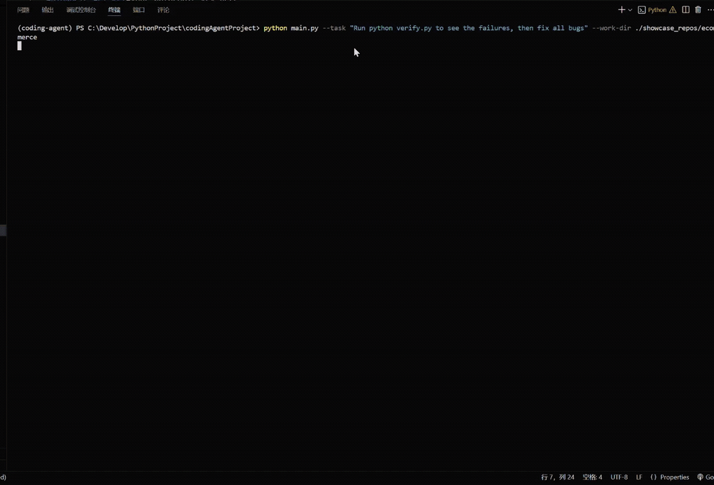

<div align="center">


# 🤖 CodingAgent

**从零构建的 Python Coding Agent，核心循环仅 ~340 行，具备完整的工具调用、安全中间件、多 Agent 协作与评测体系。**

[](https://github.com/1234wxyz/CodingAgent/stargazers)
[](https://github.com/1234wxyz/CodingAgent/network/members)
[](https://www.python.org/)
[](LICENSE)
[](tests/)

</div>

---

## 🎯 项目介绍

一个从零实现的可评测、可观测的 Python Coding Agent。通过 middleware 分离安全与上下文管理，通过 tool-calling 扩展能力，支持角色化多 Agent 协作、持久化任务追踪与 prompt 版本化评测。

---

<table>
<tr>
<td align="center" width="33%">

**🛠️ 多工具协同**<br>
bash + file_edit + 语义检索 三位一体

</td>
<td align="center" width="33%">

**🛡️ 中间件安全链**<br>
3 层中间件守护运行安全

</td>
<td align="center" width="33%">

**📐 工作流纪律**<br>
分析 → 复现 → 修复 → 验证 → 总结

</td>
</tr>
<tr>
<td align="center">

**🤝 多 Agent 协作**<br>
explorer / reviewer / tester 角色委派

</td>
<td align="center">

**📊 结构化可观测**<br>
Trajectory JSONL + 终端 Dashboard

</td>
<td align="center">

**🧪 内置评测体系**<br>
6 场景 + 5 基准 + A/B 对比

</td>
</tr>
</table>

---

<p align="center"></p>

---

## 🚀 快速开始

```bash
# 1. 克隆 & 安装
git clone https://github.com/1234wxyz/CodingAgent.git
cd CodingAgent
pip install -e ".[dev]"          # Python >= 3.11

# 2. 配置环境变量
cat > .env <<'EOF'
MODEL_NAME=deepseek/deepseek-chat
DEEPSEEK_API_KEY=your_key_here
EOF

# 3. 启动
python main.py                   # 交互模式（流式输出）
```

单次任务模式：

```bash
python main.py --task "修复 calculator.py 中的 ZeroDivisionError" --work-dir ./demo/bug_scenarios/zero_division
```

---

## 🏗️ 架构总览

<p align="center"></p>

### 运行时数据流

```text
用户请求
  │
  ▼
┌──────────────────────────────────────────────────────────┐
│  System Prompt 组装 (context.py + prompts/*.yaml)        │
│                                                          │
│  ┌────────────────────────────────────────────────────┐  │
│  │  Agent Loop (core.py, ~340 行)                     │  │
│  │  run → step → query → dispatch → trajectory        │  │
│  │       ↑                     │                      │  │
│  │  Middleware Hooks       Tool Executor               │  │
│  │  (pre_step / post_step)     │                      │  │
│  └─────────────────────────────┼──────────────────────┘  │
│                                ▼                          │
│  ┌────────┬───────────┬─────────────┬──────────┬──────┐  │
│  │  bash  │ file_edit │semantic_search│task_board│delegate│
│  │ (shell)│(确定性编辑)│(tree-sitter) │(.tasks/) │(子Agent)│
│  └────────┴───────────┴─────────────┴──────────┴──────┘  │
└──────────────────────────────────────────────────────────┘
  │
  ▼
┌──────────────────────────────────────────────────────────┐
│  Middleware Chain                                         │
│  ┌──────────────────┐ ┌───────────────┐ ┌─────────────┐ │
│  │  BashSafety      │ │SandboxAwareness│ │ContextCompact│ │
│  │ (12 条风险规则)   │ │(环境探测/注入) │ │(LLM 摘要压缩)│ │
│  └──────────────────┘ └───────────────┘ └─────────────┘ │
└──────────────────────────────────────────────────────────┘
  │
  ▼
Trajectory JSONL  →  终端 Dashboard  →  Benchmark 评分卡
```

### 核心模块职责

| 模块 | 文件 | 职责 |
|------|------|------|
| **Agent 主循环** | `core.py` | 极薄循环（~340 行）：run → step → query → dispatch，只管调度，不管安全和 Prompt |
| **Prompt 引擎** | `context.py` | 系统 Prompt 组装、YAML 加载、输出截断、上下文压缩、历史摘要、Transcript 归档 |
| **中间件链** | `middleware.py` | BashSafety / SandboxAwareness / ContextCompaction，通过 pre_step/post_step 钩子注入 |
| **LLM 适配** | `models.py` | litellm 统一适配、流式输出、指数退避重试、模型 Fallback 链 |
| **应用组装** | `app.py` | 工具注册、中间件编排、CLI 入口、流式 UI |

### 工具矩阵

| 工具 | 类型 | 说明 |
|------|------|------|
| `bash` | Shell 执行 | 跨平台无状态 Shell，长输出自动截断，环境变量不跨调用持久化 |
| `file_edit` | 确定性编辑 | view / replace / create 三指令，精确文本匹配替换，路径沙箱保护 |
| `semantic_search` | 符号检索 | 基于 tree-sitter 的 Python 符号搜索：list_symbols / find_symbol / get_context |
| `task_board` | 任务持久化 | 多步任务状态持久化到 `.tasks/`，在上下文压缩后仍可恢复进度 |
| `delegate` | 子 Agent | 角色化委派（explorer / reviewer / tester），隔离上下文独立运行 |

### 目录结构

```
agent/                  # 核心 Agent 代码
├── core.py / context.py / middleware.py / models.py / app.py
└── tools/              # bash / file_edit / semantic_search / task_board / delegate

scripts/                # 评测 / Dashboard / Prompt 对比
prompts/                # 版本化系统 Prompt（YAML）
tests/                  # 115 个离线测试
demo/bug_scenarios/     # 6 个 Bug 场景模板
benchmarks/             # 5 个自包含基准实例
```

---

## 🔑 核心设计

### 🛠️ 多工具协同：Shell + 确定性编辑 + 语义检索

Agent 拥有三类互补的代码操作工具：`bash` 执行任意 Shell 命令（适合探索、运行测试、复杂脚本），`file_edit` 提供精确的文本匹配替换（避免 sed 正则出错），`semantic_search` 基于 tree-sitter 做 Python 符号级检索（比 grep 更理解代码结构）。三者各司其职，由 Agent 根据场景自主选择。

### 🛡️ Middleware 安全链：安全逻辑不侵入主循环

所有安全与上下文管理通过 `middleware.py` 的 `pre_step`/`post_step` 钩子实现，`core.py` 完全无感知。

| 中间件 | 职责 |
|--------|------|
| **BashSafety** | 拦截 `rm -rf /`、`sudo` 等 12 类危险命令，包裹 tool executor |
| **SandboxAwareness** | 首次运行时探测环境（Docker / CI / 本地），注入约束到系统 Prompt |
| **ContextCompaction** | 压缩旧工具输出、LLM 摘要历史、归档完整 Transcript |

### 📐 5 步工作流纪律

系统 Prompt 强制执行严格动作序列：**分析 → 复现 → 修复 → 验证 → 总结**。每一步只做一件事 —— 调用工具或返回最终答案，不混杂叙述与操作。验证通过后可选执行额外检查（仅在有具体回归风险时触发），否则立即结束。

---

## 🧪 评测能力

| 类型 | 名称 | 描述 |
|------|------|------|
| 场景 | `zero_division` | `average([])` 应返回 0.0 而非抛异常 |
| 场景 | `trailing_window` | 滑动窗口 off-by-one |
| 场景 | `loyalty_checkout` | 未知客户等级折扣逻辑 |
| 场景 | `type_error` | `int + str` 类型拼接错误 |
| 场景 | `import_cycle` | 多文件循环导入 |
| 场景 | `missing_return` | 函数缺少 return |
| 基准 | `dict_merge_overwrite` | 浅拷贝导致配置覆盖 |
| 基准 | `csv_quoting` | 字段引号缺失 |
| 基准 | `datetime_edge` | 日期计算 off-by-one |
| 基准 | `regex_escape` | 正则特殊字符未转义 |
| 基准 | `recursion_depth` | 深层输入触发 RecursionError |

```bash
pytest tests/ -v                       # 115 个离线测试
python scripts/run_scenarios.py        # 6 个场景端到端验证
python scripts/benchmark.py            # 5 实例基准评分卡
python scripts/dashboard.py trajectories/  # 终端 Dashboard
```

---

## 📊 项目数据

| 指标 | 数值 |
|------|------|
| 核心循环 | ~340 行 |
| Agent 总代码 | ~3300 行 |
| 离线测试 | 115 |
| 工具 | 5（bash / semantic_search / task_board / delegate / file_edit） |
| 中间件 | 3（safety / sandbox / compaction） |
| 评测实例 | 6 场景 + 5 基准 |
| Prompt 版本 | 2（YAML，支持 A/B 对比） |

---

## 🗺️ 后续规划

- [ ] 支持更多 LLM 后端（OpenAI / Claude / 本地模型）
- [ ] Web UI 交互界面
- [ ] SWE-bench Lite 评测集成
- [ ] 工具调用并行化

---

## 📚 参考项目

- [mini-swe-agent](https://github.com/SWE-agent/mini-swe-agent) — Workflow-first prompt 设计
- [Reflexion](https://github.com/noahshinn/reflexion) — 自省循环
- [CrewAI](https://github.com/crewAIInc/crewAI) — 角色化多 Agent 模式
- [promptfoo](https://github.com/promptfoo/promptfoo) — Prompt 版本化与 A/B 测试
- [SWE-bench](https://github.com/princeton-nlp/SWE-bench) — 评测方法论
- [litellm](https://github.com/BerriAI/litellm) — 统一 LLM 适配层
- [claude-agent-sdk](https://github.com/anthropics/claude-agent-sdk) — Tool schema 参考
- [serena](https://github.com/oraios/serena) — 符号级代码搜索

---

## 📄 License

本项目基于 [MIT License](LICENSE) 开源。

---

<div align="center">

## Star History

[](https://star-history.com/#1234wxyz/CodingAgent&Date)

**如果这个项目对你有帮助，请给一个 ⭐ Star 支持！**

</div>
